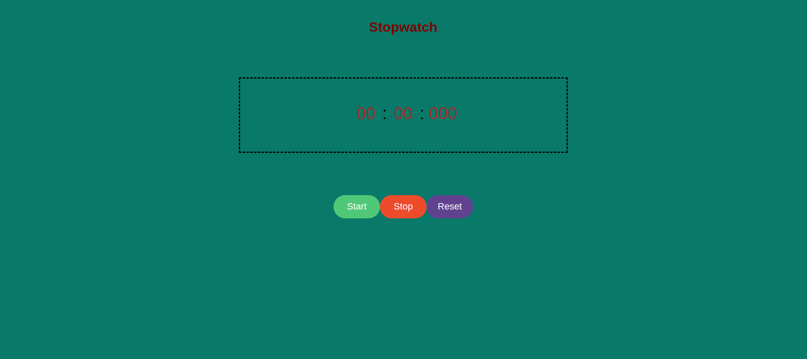

# Stop watch

> This project is to develop a digital stopwatch application with three primary
> functionalities: start, stop, and reset. The stopwatch will allow users to
> accurately measure elapsed time from the moment it is started until it is
> stopped. Additionally, users should be able to reset the stopwatch to its
> initial state at any point.

## Table of contents

- [Stop watch](#stop-watch)
  - [Table of contents](#table-of-contents)
  - [General info](#general-info)
  - [Screenshots](#screenshots)
  - [Technologies](#technologies)
  - [Setup](#setup)
  - [Code Examples](#code-examples)
  - [Features](#features)
  - [Status](#status)
  - [Inspiration](#inspiration)
  - [Contact](#contact)

## General info

The objective of this project is to practice Separation of Concerns and use
`setInterval` and `stopInterval` APIs

## Screenshots



## Technologies

- JavaScript
- HTML5
- CSS3
- VSC code
- Jest

## Setup

Create a new repo from the template

1. Clone the repo from your GitHub account
   > git clone `HTTPS link`
2. Open Visual Studio Code
3. Run npm i
4. Open index.html

## Code Examples

```js
export const data = {
	minutes: 0,
	seconds: 0,
	milliseconds: 0,
	intervalId: null,
	oldMinutes: 0,
	oldSeconds: 0,
};

export default data;
```

## Features

Start Functionality: Upon initiating the stopwatch, the timer will begin
counting elapsed time in seconds, minutes, and hours. This function should be
triggered by a user-initiated action, such as clicking a "Start" button.

Stop Functionality: Users will have the ability to pause the stopwatch, halting
the counting of elapsed time. This function should be activated by a
user-initiated action, such as clicking a "Stop" button.

Reset Functionality: The stopwatch will include a feature that allows users to
reset the timer to zero, effectively clearing all previously measured time. This
function should be initiated by a user action, such as clicking a "Reset"
button.

To-do list:

1. Define Project Requirements:

Clearly outline the functionalities required for the stopwatch application,
including start, stop, and reset.

2. Design User Interface:

Sketch or wireframe the layout of the stopwatch application's user interface,
incorporating start, stop, and reset buttons.

1. Implement Stopwatch Logic
2. Test Functionality

## Status

Project is: Completed

## Inspiration

## Contact

By [Richelle Pintucan](https://github.com/richellepintucan)
