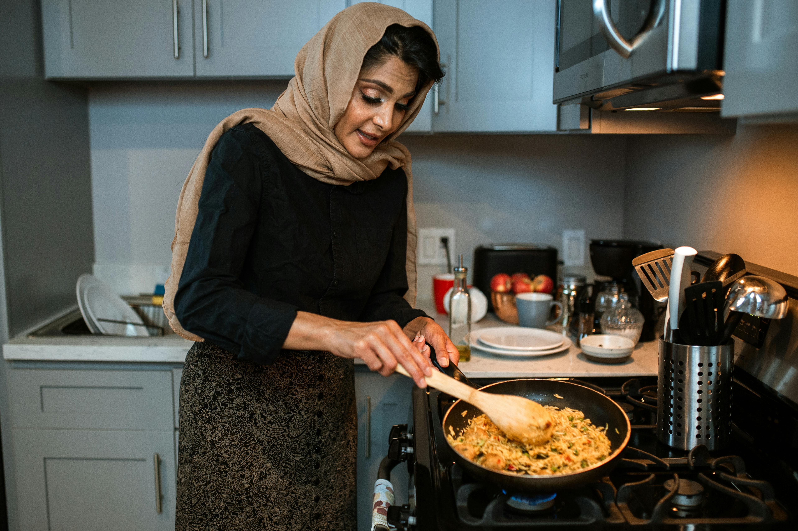
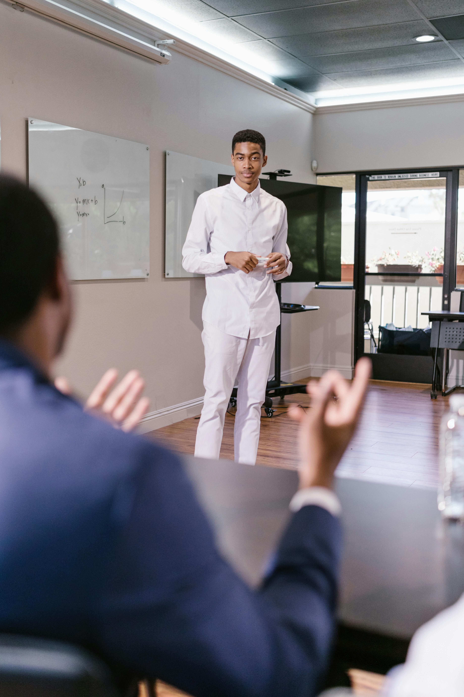

# User Personas

## Lisa, 45

Cooking Enthusiast - Lisa:

Background: Lisa is a cooking enthusiast who loves trying out new recipes and
experimenting with different cooking techniques.

Goals: Lisa wants a stopwatch app to time cooking processes such as baking,
boiling, and simmering to ensure precise cooking times and avoid overcooking or
undercooking.

Needs: Lisa requires a stopwatch application with audible alerts, customizable
timer settings, and the ability to run in the background while she attends to
other kitchen tasks.

Challenges: Lisa may face challenges in multitasking and managing cooking times
effectively if the stopwatch app lacks audible alerts or if the timer display is
not visible from a distance in the kitchen.

---

## Michael, 37

Professional Speaker - Michael:

Background: Michael is a professional speaker and presenter who delivers talks
and workshops at conferences and events.

Goals: Michael needs a stopwatch application to time his presentations, monitor
speaking durations, and manage time effectively during speaking engagements.

Needs: Michael requires a stopwatch app with visible timer display and discreet
controls to start, stop, and reset the timer without distracting the audience.

Challenges: Michael may encounter challenges in timing his presentations
accurately if the stopwatch interface lacks visibility or if the controls are
not easily accessible during
